# Sơ đồ Cấu trúc Thành phần (Component Tree)
**Dự án:** Hệ thống Tìm kiếm và Cho thuê Phòng trọ (Rental Room System)
**Người thực hiện:** @ductran281206-cell (Trần Nguyên Đức)

Tài liệu này định nghĩa cấu trúc phân cấp và mối quan hệ giữa các thành phần giao diện (Components) trong dự án. Để xem trực quan dạng hình ảnh, tham khảo file [component-tree.png](./component-tree.png).

---

## 1. Phân loại Thành phần (Component Classification)

Hệ thống được chia thành hai nhóm thành phần chính nhằm đảm bảo tính phân tách mã nguồn (Separation of Concerns):

### A. Containers / Pages (Trang chính & Quản lý Trạng thái)
Các thành phần này đại diện cho toàn bộ màn hình (screens) của ứng dụng, chịu trách nhiệm quản lý logic luồng, kết nối dữ liệu từ API (`json-server`), quản lý state lớn và phối hợp các component con.
- **`HomePage.jsx`** (`src/pages/HomePage.jsx`): Trang chủ tổng hợp các danh mục và phòng trọ nổi bật.
- **`RoomListPage.jsx`** (`src/pages/RoomListPage.jsx`): Trang danh sách, tìm kiếm, lọc và phân trang các phòng trọ.
- **`RoomDetailPage.jsx`** (`src/pages/RoomDetailPage.jsx`): Trang chi tiết phòng trọ (nhận `:id` từ URL qua `useParams()`).
- **`CartPage.jsx`** (`src/pages/CartPage.jsx`): Trang quản lý giỏ hàng/các phòng quan tâm trước khi đặt cọc.
- **`RoomManagePage.jsx`** (`src/pages/admin/RoomManagePage.jsx`): Trang quản lý dành cho Admin/Chủ trọ, thực hiện CRUD phòng trọ.

### B. Reusable Components (Thành phần Tái sử dụng)
Các thành phần giao diện nhỏ, độc lập, nhận dữ liệu qua `props`, có thể tái sử dụng ở nhiều màn hình khác nhau và ít phụ thuộc vào logic nghiệp vụ cụ thể.
- **`Header.jsx`** (`src/components/Header.jsx`): Thanh điều hướng chung (Logo, Links, Cart Badge, Theme Toggle).
- **`Footer.jsx`** (`src/components/Footer.jsx`): Chân trang hiển thị thông tin liên hệ và mạng xã hội.
- **`SectionWrapper.jsx`** (`src/components/SectionWrapper.jsx`): Layout bọc ngoài các section để đồng bộ khoảng cách và tiêu đề.
- **`Banner.jsx`** (`src/components/Banner.jsx`): Banner chào mừng và nút kêu gọi hành động (CTA).
- **`CategoryList.jsx`** (`src/components/CategoryList.jsx`): Danh sách 5 thẻ loại hình phòng trọ.
- **`RoomGrid.jsx`** (`src/components/RoomGrid.jsx`): Lưới hiển thị danh sách thẻ phòng trọ.
- **`RoomCard.jsx`** (`src/components/RoomCard.jsx`): Thẻ hiển thị thông tin nhanh của một phòng trọ.
- **`SearchBar.jsx`** (`src/components/SearchBar.jsx`): Thanh tìm kiếm thông minh hỗ trợ debounce.
- **`RoomFilter.jsx`** (`src/components/RoomFilter.jsx`): Bộ lọc phòng trọ (theo giá, loại hình, tiện ích).
- **`Pagination.jsx`** (`src/components/Pagination.jsx`): Thanh điều hướng phân trang.
- **`RoomGallery.jsx`** (`src/components/RoomGallery.jsx`): Thư viện hiển thị ảnh thực tế của phòng trọ.
- **`RoomInfo.jsx`** (`src/components/RoomInfo.jsx`): Khối hiển thị chi tiết giá thuê, tiền cọc, diện tích, trạng thái, tiện ích.
- **`AISummary.jsx`** (`src/components/AISummary.jsx`): Thành phần phân tích và đưa ra điểm phù hợp từ AI.
- **`BookingButton.jsx`** (`src/components/BookingButton.jsx`): Nút thêm phòng vào giỏ hàng đặt cọc.
- **`CartTable.jsx`** (`src/components/CartTable.jsx`): Bảng liệt kê các phòng đã chọn với chức năng tăng giảm số tháng cọc và xóa.
- **`CartSummary.jsx`** (`src/components/CartSummary.jsx`): Khối tính toán tổng tiền cọc và nút gửi yêu cầu thuê phòng.
- **`RoomModal.jsx`** (`src/components/admin/RoomModal.jsx`): Modal Form để thêm mới hoặc chỉnh sửa thông tin phòng trọ (Admin).

---

## 2. Sơ đồ Component Tree (Mermaid Diagram)

Dưới đây là sơ đồ phân cấp cấu trúc React Component Tree:

```mermaid
graph TD
    %% Define Styles %%
    classDef root fill:#1E293B,stroke:#38BDF8,stroke-width:2px,color:#fff;
    classDef global fill:#0F172A,stroke:#64748B,stroke-width:2px,color:#94A3B8;
    classDef page fill:#1E3A8A,stroke:#2563EB,stroke-width:2px,color:#fff;
    classDef component fill:#4C1D95,stroke:#7C3AED,stroke-width:2px,color:#fff;
    classDef admin fill:#881337,stroke:#E11D48,stroke-width:2px,color:#fff;

    %% Components %%
    App[App.jsx]:::root
    
    Header[Header.jsx]:::global
    Footer[Footer.jsx]:::global
    SecWrap[SectionWrapper.jsx]:::global
    
    HomePage[HomePage.jsx]:::page
    RoomListPage[RoomListPage.jsx]:::page
    RoomDetailPage[RoomDetailPage.jsx]:::page
    CartPage[CartPage.jsx]:::page
    RoomManagePage[RoomManagePage.jsx]:::admin

    Banner[Banner.jsx]:::component
    CategoryList[CategoryList.jsx]:::component
    RoomGrid[RoomGrid.jsx]:::component
    RoomCard[RoomCard.jsx]:::component
    SearchBar[SearchBar.jsx]:::component
    RoomFilter[RoomFilter.jsx]:::component
    Pagination[Pagination.jsx]:::component
    RoomGallery[RoomGallery.jsx]:::component
    RoomInfo[RoomInfo.jsx]:::component
    AISummary[AISummary.jsx]:::component
    BookingButton[BookingButton.jsx]:::component
    CartTable[CartTable.jsx]:::component
    CartSummary[CartSummary.jsx]:::component
    RoomModal[RoomModal.jsx]:::admin

    %% Tree Links %%
    App --> Header
    App --> Footer
    
    %% Routes mapping
    App -.-> |Route /| HomePage
    App -.-> |Route /rooms| RoomListPage
    App -.-> |Route /rooms/:id| RoomDetailPage
    App -.-> |Route /cart| CartPage
    App -.-> |Route /admin| RoomManagePage

    %% HomePage Details
    HomePage --> Banner
    HomePage --> SecWrap
    SecWrap --> CategoryList
    HomePage --> RoomGrid
    RoomGrid --> RoomCard

    %% RoomListPage Details
    RoomListPage --> SearchBar
    RoomListPage --> RoomFilter
    RoomListPage --> RoomGrid
    RoomListPage --> Pagination

    %% RoomDetailPage Details
    RoomDetailPage --> RoomGallery
    RoomDetailPage --> RoomInfo
    RoomDetailPage --> AISummary
    RoomDetailPage --> BookingButton

    %% CartPage Details
    CartPage --> CartTable
    CartPage --> CartSummary

    %% Admin Details
    RoomManagePage --> RoomModal
```

---

## 3. Luồng Dữ liệu & State Chính (Data & State Flow)

1. **Giỏ hàng (Cart State):**
   - Được lưu tại Context cấp ứng dụng (`App.jsx` hoặc `CartContext.js`) để chia sẻ trạng thái giữa `Header` (hiển thị số lượng badge), `RoomDetailPage` (thêm phòng), và `CartPage` (hiển thị danh sách, tính tiền và xóa phòng).

2. **Dữ liệu phòng trọ (Rooms Data):**
   - **`RoomListPage`**: Thực hiện fetch dữ liệu từ `json-server` (endpoint `/rooms`), quản lý các state lọc (`activeCategory`, `priceRange`, `searchQuery`). Sau đó truyền mảng phòng đã lọc xuống cho `RoomGrid`.
   - **`RoomDetailPage`**: Đọc tham số `id` từ URL qua `useParams()`, fetch chi tiết phòng trọ từ API (`/rooms/:id`), truyền dữ liệu xuống `RoomGallery`, `RoomInfo`, và `AISummary`.
   - **`RoomManagePage`**: Đọc trực tiếp danh sách phòng trọ từ `/rooms` để hiển thị trong bảng admin và thực thi các thao tác API POST/PUT/DELETE qua form trong `RoomModal`.
