# Sơ đồ Component Tree - Dự án RentWise

Tài liệu này phác thảo sơ đồ cây Component (Component Tree) cho dự án thuê phòng trọ **RentWise**. Trong kiến trúc này, chúng ta phân tách rõ ràng giữa **Container/Page** (các trang hoặc vùng chứa logic) và **Reusable Component** (các phần tử giao diện tái sử dụng được).

## 1. Định nghĩa

- 🟢 **Container / Page Component**: Là các component đóng vai trò làm trang (Page) hoặc khối lớn chứa logic chính của trang. Chúng chịu trách nhiệm giao tiếp với API, quản lý State và truyền dữ liệu (props) xuống cho các component con.
  - *Ví dụ:* `HomePage`, `RoomDetailPage`, `HeroBanner`, `FilterBar`.
- 🟠 **Reusable Component**: Là các component mang tính trình diễn (Presentational), độc lập với logic nghiệp vụ (dumb components). Chúng nhận dữ liệu từ props và chỉ có nhiệm vụ hiển thị giao diện để có thể tái sử dụng nhiều lần ở nhiều nơi.
  - *Ví dụ:* `Header`, `Footer`, `RoomCard`, `CategoryCard`.

---

## 2. Sơ đồ Component Tree (Mermaid)

```mermaid
graph TD
    classDef container fill:#2d3748,stroke:#4fd1c5,stroke-width:2px,color:#fff,rx:5px,ry:5px;
    classDef reusable fill:#4a5568,stroke:#fc8181,stroke-width:2px,color:#fff,rx:5px,ry:5px;
    classDef app fill:#1a202c,stroke:#ecc94b,stroke-width:3px,color:#fff,rx:10px,ry:10px;

    App["App (Root)"]:::app
    
    %% Pages (Containers)
    HomePage["HomePage (Page)"]:::container
    RoomListPage["RoomListPage (Page)"]:::container
    RoomDetailPage["RoomDetailPage (Page)"]:::container
    BookingCartPage["BookingCartPage (Page)"]:::container

    App --> HomePage
    App --> RoomListPage
    App --> RoomDetailPage
    App --> BookingCartPage

    %% Reusable Components (Global)
    Header["Header (Reusable)"]:::reusable
    Footer["Footer (Reusable)"]:::reusable
    RoomGrid["RoomGrid (Reusable)"]:::reusable
    RoomCard["RoomCard (Reusable)"]:::reusable
    CategoryCard["CategoryCard (Reusable)"]:::reusable

    %% HomePage specific
    HeroBanner["HeroBanner (Container)"]:::container
    CategoryList["CategoryList (Container)"]:::container

    HomePage --> Header
    HomePage --> HeroBanner
    HomePage --> CategoryList
    CategoryList --> CategoryCard
    HomePage --> RoomGrid
    HomePage --> Footer

    %% RoomListPage specific
    FilterBar["FilterBar (Container)"]:::container
    Pagination["Pagination (Reusable)"]:::reusable

    RoomListPage --> Header
    RoomListPage --> FilterBar
    RoomListPage --> RoomGrid
    RoomGrid --> RoomCard
    RoomListPage --> Pagination
    RoomListPage --> Footer

    %% RoomDetailPage specific
    RoomGallery["RoomGallery (Container)"]:::container
    RoomInfo["RoomInfo (Container)"]:::container
    Amenities["Amenities (Container)"]:::container
    BookingActions["BookingActions (Container)"]:::container

    RoomDetailPage --> Header
    RoomDetailPage --> RoomGallery
    RoomDetailPage --> RoomInfo
    RoomDetailPage --> Amenities
    RoomDetailPage --> BookingActions
    RoomDetailPage --> Footer

    %% BookingCartPage specific
    CartTable["CartTable (Container)"]:::container
    CartItem["CartItem (Reusable)"]:::reusable
    CartSummary["CartSummary (Container)"]:::container

    BookingCartPage --> Header
    BookingCartPage --> CartTable
    CartTable --> CartItem
    BookingCartPage --> CartSummary
    BookingCartPage --> Footer
```

*(Ghi chú: Trong sơ đồ trên, các ô viền Xanh dương là Container/Page, các ô viền Đỏ là Reusable Component)*

---

## 3. Chi tiết các thành phần tái sử dụng (Reusable Components)

1. **`Header`**: Thanh điều hướng trên cùng, chứa Logo, Navigation Links và Giỏ hàng (Booking Cart icon). Sử dụng chung cho mọi trang.
2. **`Footer`**: Chân trang chứa thông tin bản quyền và link liên kết.
3. **`RoomCard`**: Thẻ hiển thị một phòng trọ cụ thể (bao gồm Thumbnail, Tiêu đề, Giá, Tiện ích nhỏ, nút Book).
4. **`RoomGrid`**: Grid layout bao bọc xung quanh nhiều `RoomCard`. Có thể tái sử dụng ở Trang chủ (Mục nổi bật) và Trang danh sách.
5. **`CategoryCard`**: Thẻ hiển thị danh mục phòng (Studio, Ở ghép, v.v.).
6. **`Pagination`**: Thanh phân trang có thể tái sử dụng cho bất kỳ danh sách nào.
7. **`CartItem`**: Một dòng (row) trong giỏ hàng, chứa thông tin phòng đã chọn và input số tháng thuê.
